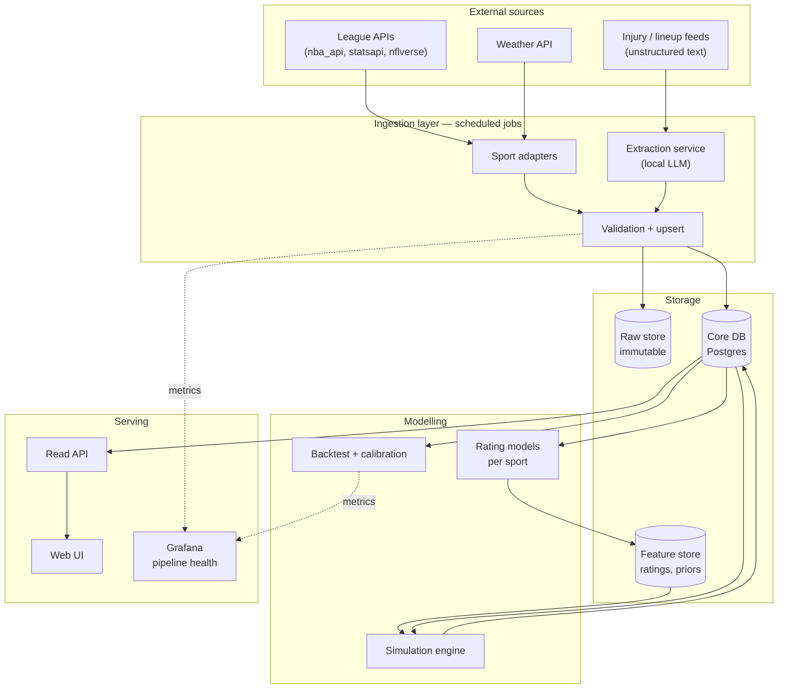

# Multi-Sport Game Simulator — System Design

**Status:** Design only. No implementation.
**Scope:** NBA, WNBA, NFL, MLB, and association football (soccer).

---

## 1. Purpose

A system that ingests sports data continuously, maintains team and player ratings, and simulates upcoming fixtures thousands of times to produce probabilistic forecasts: win probability, score distributions, and projected player stat lines with uncertainty ranges.

The output is a **distribution**, never a single prediction. "Team A wins 63% of simulations, median score 112–108" is the product. "Team A will win 112–108" is not.

---

## 2. Non-goals and honest limits

Stating these up front because they shape the whole design:

- **This will not beat the betting market.** Closing lines aggregate more information than any solo model. Target: match a naive baseline early, beat it modestly later.
- **Player stat lines will be noisy.** The model can be well-calibrated on the distribution and still miss any individual night badly. This is a property of sport, not a bug to fix.
- **"Daily world updates" is deliberately narrow.** Injuries, lineups, rest, transactions, weather. General news sentiment is noise and is excluded by design.
- **No live in-game simulation in v1.** Pre-game only. Live win probability is a separate problem with different latency requirements.

---

## 3. Architecture overview

Five layers, each independently deployable and independently failing.



**The critical boundary:** ingestion writes, serving reads. They share only the database. Neither needs the other running.

---

## 4. Ingestion layer

### 4.1 Sport adapter interface

The single most important design decision. Every sport implements the same contract, so the core knows nothing about any specific sport.

```
SportAdapter
  ├─ fetch_schedule(date_range)      → Game[]
  ├─ fetch_results(since_watermark)  → GameResult[]
  ├─ fetch_boxscores(game_ids)       → PlayerGameLine[]
  ├─ fetch_rosters()                 → RosterEntry[]
  ├─ fetch_availability()            → AvailabilityFlag[]
  └─ sport_config                    → SportConfig
```

`SportConfig` carries the sport's structural parameters — scoring unit, period structure, whether the simulation is possession-based or event-based, typical possession count, home advantage prior, regression strength.

Adding a sixth sport later means writing one adapter, not touching the engine.

### 4.2 Source mapping

| Sport | Primary source | Notes |
|---|---|---|
| NBA | `nba_api` | Free, rich, rate-limited; needs backoff |
| WNBA | `nba_api` (WNBA endpoints) | Sparser history, shorter season — regress harder |
| NFL | `nflverse` / `nfl_data_py` | Play-by-play with EPA precomputed |
| MLB | MLB StatsAPI | The best free sports API that exists |
| Soccer | `soccerdata` (FBref) or paid API | xG availability varies by competition |
| Weather | Open-Meteo | Only for NFL, MLB, outdoor soccer |
| Injuries/lineups | Team feeds, beat reporters | Unstructured — goes through extraction service |

### 4.3 Job schedule

| Job | Cadence | Latency tolerance |
|---|---|---|
| `ingest.results` | Nightly, 04:00 | Hours |
| `ingest.schedule` | Daily, 08:00 | Days |
| `ingest.rosters` | Daily, 08:00 | Hours |
| `ingest.injuries` | Every 3h; hourly on gameday | ~1h |
| `ingest.lineups` | Every 15min, T-4h to T-0 | Minutes |
| `ingest.weather` | T-6h and T-1h | Hours |
| `model.ratings` | After `ingest.results` | Hours |
| `model.simulate` | After ratings; re-run on lineup change | Minutes |

### 4.4 Job contract

Every ingestion job obeys the same three rules:

1. **Idempotent.** All writes are upserts keyed on a natural key (`game_id`, `player_id + game_id`). Re-running a job is always safe.
2. **Watermarked.** Each job stores `last_successful_through` and fetches only forward from it. Full backfill is an explicit separate mode.
3. **Instrumented.** Every run writes to `ingest_runs`: job name, sport, start/end, status, rows written, error text.

Rule 3 is what makes a stale scraper visible instead of silent.

### 4.5 Raw store

Every external response is written unmodified to object storage, partitioned `sport/source/date/`, before parsing. Two reasons: reprocessing after a parser bugfix doesn't require refetching, and it's the only way to debug "the numbers changed and I don't know why."

---

## 5. Extraction service (local LLM)

**Scope: unstructured text only.** Structured API responses never touch the LLM.

**Input:** injury report text, transaction notes, beat-writer posts.
**Output:** strictly schema-constrained JSON.

```json
{
  "player_name": "string",
  "team": "string",
  "status": "out | doubtful | questionable | probable | active",
  "reason": "string | null",
  "source_confidence": 0.0,
  "as_of": "ISO-8601"
}
```

**Design rules:**

- Constrained decoding or JSON-schema-enforced output. Free-form parsing is not acceptable.
- Anything failing schema validation is rejected to a dead-letter queue and reviewed, never coerced.
- Name resolution against the roster table happens *after* extraction, in normal code, with fuzzy matching and an explicit unmatched queue. The LLM does not guess at IDs.
- A player's availability is only updated if the new record's `as_of` is more recent than the stored one.
- Extraction output is advisory: it sets a flag with a confidence, and low-confidence flags widen the simulation's uncertainty rather than hard-excluding a player.

**Model class:** 8B instruct-tier is sufficient. This is extraction, not reasoning. Served via Ollama or vLLM behind an OpenAI-compatible endpoint so the model is swappable without touching pipeline code.

---

## 6. Data model

Core tables, sport-agnostic where possible:

```
sports              (sport_id, name, config_json)
teams               (team_id, sport_id, name, venue_id, external_ids_json)
players             (player_id, sport_id, name, position, external_ids_json)
games               (game_id, sport_id, date_utc, home_team_id, away_team_id,
                     venue_id, status, season, week_or_round)
game_results        (game_id, home_score, away_score, periods_json)
player_game_lines   (game_id, player_id, team_id, stats_json, minutes_or_snaps)
roster_entries      (sport_id, team_id, player_id, valid_from, valid_to)
availability_flags  (player_id, game_id, status, confidence, source, as_of)
venues              (venue_id, name, lat, lon, is_indoor, altitude, park_factors_json)
weather_snapshots   (game_id, as_of, temp_c, wind_kph, precip_mm)

team_ratings        (sport_id, team_id, as_of, rating_json)
player_rates        (sport_id, player_id, as_of, rates_json, sample_weight)

simulations         (sim_id, game_id, model_version, run_at, n_iterations, inputs_hash)
sim_outcomes        (sim_id, home_win_prob, score_dist_json, margin_dist_json)
sim_player_lines    (sim_id, player_id, stat_dist_json)

ingest_runs         (run_id, job, sport_id, started_at, ended_at, status, rows, error)
model_evaluations   (eval_id, sport_id, model_version, window, brier, log_loss,
                     calibration_json, ats_or_baseline_delta)
```

**Design notes:**

- `stats_json` / `rates_json` are JSONB rather than wide typed columns. Five sports have five stat vocabularies; forcing them into shared columns creates a table that's 80% nulls.
- `roster_entries` is bitemporal (`valid_from`/`valid_to`) so historical simulations can be reconstructed with the roster as it was, not as it is.
- `simulations.inputs_hash` fingerprints every input. If the hash is unchanged, skip the re-run. This is what makes "re-simulate on lineup change" cheap.

---

## 7. Simulation engine

### 7.1 Shared core

The engine is a Monte Carlo loop that knows nothing about any sport:

```
simulate(game, n=20000):
    for i in 1..n:
        state = sport.init_state(game, ratings, availability)
        while not sport.is_complete(state):
            event = sport.sample_event(state, rng)
            state = sport.apply(state, event)
        record(state)
    return aggregate(records)
```

Everything sport-specific lives behind `sample_event` and `apply`. The aggregation, distribution reporting, and persistence are shared.

### 7.2 Per-sport event models

| Sport | Unit | Approach |
|---|---|---|
| NBA / WNBA | Possession | Sample possession outcome from offensive rating vs defensive rating, adjusted for pace. Allocate the shot to a player by usage rate, then resolve by that player's efficiency profile. ~100 possessions/team. |
| NFL | Drive | Sample drive outcome (TD/FG/punt/turnover) from offensive EPA vs defensive EPA, adjusted for field position and weather. ~11 drives/team. Small sample means heavy regression to league prior. |
| MLB | Plate appearance | Log5 matchup of batter rates vs pitcher rates, modified by park factors. Simulate baserunner state transitions. Handles pitching changes by lineup depth. |
| Soccer | Match-level goals | Bivariate Poisson from attacking/defensive strength (Dixon–Coles low-score correction). Not possession simulation — the event rate is too low for that to add value. Player goal/assist allocation is a second sampling step. |

### 7.3 Uncertainty handling

Two distinct sources, modelled separately:

- **Aleatoric** — the game's own randomness. Captured by the Monte Carlo loop itself.
- **Epistemic** — uncertainty in the ratings. Captured by resampling the rating parameters per iteration from their posterior, rather than treating point estimates as truth.

A questionable-status player is handled by sampling their availability per iteration at the flagged probability. This widens the output distribution honestly instead of forcing a binary in/out guess.

---

## 8. Rating models

Run nightly, after results ingestion. Per sport, but sharing a common shape:

1. **Raw aggregate** — season-to-date efficiency metrics.
2. **Opponent adjustment** — ridge regression against schedule strength.
3. **Regression to prior** — shrink toward league mean by sample size. Weight is sport-specific: aggressive for NFL and WNBA (short seasons), light for MLB and NBA.
4. **Recency weighting** — exponential decay, half-life tuned per sport.
5. **Carryover** — preseason prior blends prior-season rating with roster-change adjustment.

Player rates follow the same pattern at the individual level, with a stronger prior because per-player samples are smaller.

---

## 9. Evaluation

Non-optional, and the part that determines whether any of the above was worth building.

**Method:** walk-forward backtest. Train on data through date *T*, predict games at *T+1*, advance. No information from after the prediction date may enter the feature set — this is the single easiest way to build something that looks brilliant and is worthless.

**Metrics:**

- **Brier score** and **log loss** on win probability
- **Calibration curve** — of games predicted at 70%, did ~70% happen? A model can be accurate and badly calibrated, and calibration is what makes the output usable.
- **Baseline deltas** — versus (a) home team always wins, (b) higher-rated team always wins, (c) market closing line where available. Beating (a) and (b) is the bar for shipping. Beating (c) is not expected.
- **Player line MAE** and interval coverage — do 80% intervals contain the true value 80% of the time?

Every model version writes to `model_evaluations`. Regression in these numbers blocks promotion of a new version.

---

## 10. Serving

**Read API** (FastAPI): fixtures list, single-game forecast, player projections, model health. Reads only from the database — never triggers ingestion or simulation on request.

**Web UI:** fixture list by date and sport; game detail with win probability, score distribution histogram, projected player lines with intervals; a visible "inputs as of {timestamp}" stamp on every forecast so stale data is obvious to the reader.

**Grafana:** pipeline health from `ingest_runs`, model calibration over time from `model_evaluations`.

---

## 11. Deployment topology

Fits the existing homelab cleanly:

| Component | Placement | Rationale |
|---|---|---|
| Postgres (+ TimescaleDB) | TrueNAS, apps SSD pool | Random-IO heavy, wants the mirror |
| Raw store | TrueNAS, data pool | Bulk, sequential, cheap |
| Ingestion jobs | Containers, cron-triggered | Short-lived, independently restartable |
| Simulation worker | Container, CPU | Monte Carlo is CPU-bound, seconds per game |
| Extraction LLM | Desktop (RTX 5080), OpenAI-compatible endpoint | GPU-resident; TrueNAS box has no GPU |
| API + UI | Container | Stateless |
| Prometheus / Grafana | Existing deployment | Already running |

If the desktop is off, injury extraction degrades to "last known status" and the simulation widens its uncertainty. It does not fail the pipeline.

---

## 12. Build order

Sequenced so that each phase produces something testable and the ingestion grind doesn't block the interesting work.

**Phase 1 — Vertical slice, NBA only.**
Schema, NBA adapter, results ingestion, basic ratings, possession simulator, CLI output. Success: predicts held-out games better than "home team wins."

**Phase 2 — Evaluation harness.**
Walk-forward backtest, calibration curves, baseline comparison. Success: honest numbers exist and are believed.

**Phase 3 — Operationalise.**
Cron scheduling, `ingest_runs` instrumentation, Grafana health dashboard, watermarking. Success: runs unattended for a week without silent failure.

**Phase 4 — Availability.**
Injury/lineup ingestion, extraction service, per-iteration availability sampling. Success: measurable calibration improvement over Phase 2 numbers.

**Phase 5 — Second sport.**
MLB, because the adapter interface gets stress-tested by a fundamentally different simulation unit. Success: no core-engine changes required.

**Phase 6 — Remaining sports and web UI.**
NFL, WNBA, soccer. Frontend last.

---

## 13. Open decisions

Things the design deliberately leaves unresolved:

- **Soccer scope.** Which competitions? xG data quality varies sharply, and this drives the source choice.
- **Rating framework.** Ridge-regression adjustment is simplest; a Bayesian state-space model handles uncertainty more naturally but is slower to build and slower to fit.
- **Simulation count.** 20k iterations is a starting guess. Should be set by measuring where the win-probability estimate stabilises.
- **Retention.** How long to keep raw responses. Cheap to keep, but it grows fast on the data pool.
- **Player-level soccer modelling.** May not be worth it in v1 given data availability.
